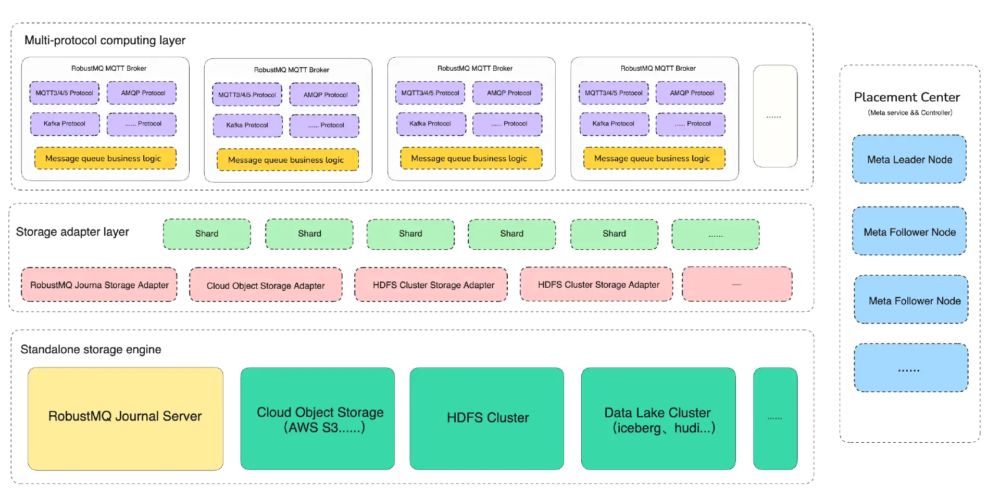

RobustMQ 是一个典型的分布式分层架构，计算层、存储层、调度层分离。由控制层（Placement Center）、计算层（Multi-protocol computing layer）、存储适配层（Storage Adapter Layer）、独立的远端存储层（Standalone storage engine） 四个部分组成。每一层都具备快速扩缩容能力，从而达到整个系统具备完整的 Serverless 能力。

- Plagement Center： RobustMQ 集群的元数据存储和调度组件。它负责集群相关的元数据存储、分发、调度等工作。比如集群节点的上下线、配置存储/分发等等。

- Multi-protocol computing layer: RobustMQ 集群的计算层 Broker 集群。它负责各种消息协议的适配和消息相关的功能实现。并将接收到数据通过Storage Adapter Layer写入到存储层存储。

- Storage Adapter Layer: 是存储适配层组件，它的作用 将多种协议 MQ 的 Topic/Queue/Partition 统一抽象为 Shard。同时负责适配不同的存储组件，比如本地文件存储、远程的HDFS、对象存储、自研的存储组件等等。从而将 Shard 数据持久化存储到不同的存储引擎。

- Standalone storage engine： 是指独立的存储引擎，比如云对象存储（比如 AWS S3），HDFS Cluster， Data Lake Cluster（iceberg，hudi 等）。同时 RobustMQ 类似Apache Bookeeper 的分布式、分段的存储服务 RobustMQ Journal Server。负责高性能完成消息数据的可靠存储，并具备无感知快速横向水平扩容能力。